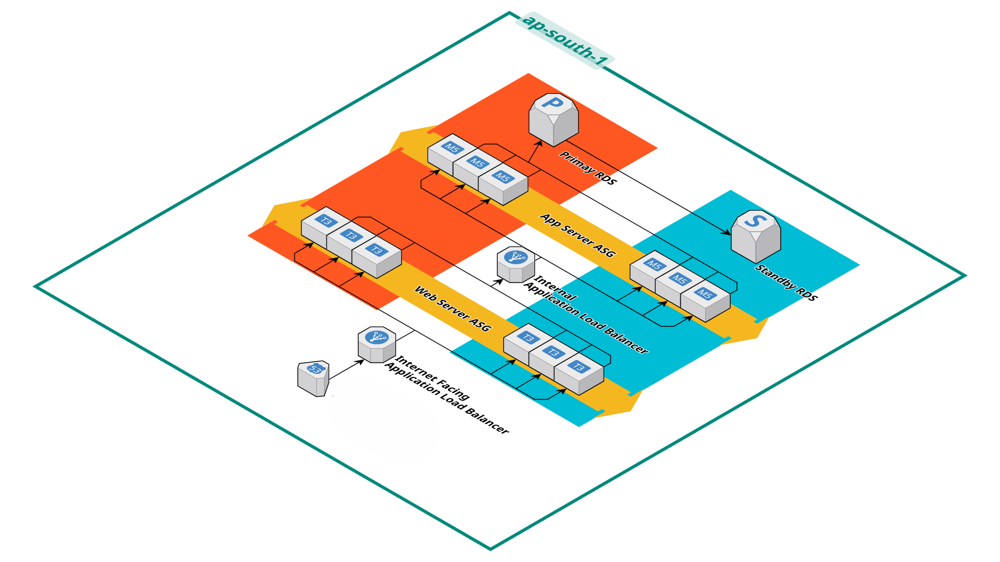

# 🚀 AWS 3-Tier Scalable Web Application

## 📌 Project Description

This project demonstrates a **production-ready 3-tier architecture on AWS** where user signup data is collected from a frontend application, processed by a backend API, and securely stored in a MySQL database.

---

## 🏗️ Architecture Overview

```

---

## 🧩 Tech Stack

* **Frontend:** HTML, CSS, JavaScript
* **Backend:** Python (Flask)
* **Database:** MySQL
* **Cloud Services:** EC2, ALB, RDS, S3

---

## ⚙️ Features

* User Signup System
* REST API using Flask
* Password Hashing (Security)
* Auto Database & Table Creation
* Load Balanced Backend
* Health Check Endpoint (`/health`)

---

## 🔐 Security

* Passwords are securely hashed before storage
* Backend servers are not publicly exposed
* Database access restricted via Security Groups

---

## 🚀 Deployment Steps

### 1️⃣ Create RDS MySQL

* Launch RDS instance
* Configure security group to allow backend EC2 access

---

### 2️⃣ Deploy Backend (EC2)

* Use Launch Template
* Add backend user data script
* Install dependencies

---

### 3️⃣ Configure Application Load Balancer

* Create target group (port 5000)
* Register backend EC2
* Set health check path to `/health`

---

### 4️⃣ Deploy Frontend

* Host on EC2 (Apache) OR S3
* Update API endpoint with ALB DNS

---

## 🔄 Application Flow

1. User enters signup details
2. Frontend sends POST request to backend via ALB
3. Backend processes the request
4. Password is hashed securely
5. Data stored in database
6. Response returned to frontend

---

## 🧪 API Testing

curl -X POST http://<ALB-DNS>/signup \
-H "Content-Type: application/json" \
-d '{"username":"test","password":"123"}'

---

## 🗄️ Database Schema

CREATE DATABASE login_db;

USE login_db;

CREATE TABLE users (
    id INT AUTO_INCREMENT PRIMARY KEY,
    username VARCHAR(255) UNIQUE,
    password VARCHAR(255)
);

---

## ⚠️ Common Issues

* ALB routing to wrong instance (frontend instead of backend)
* Port 5000 not allowed in security group
* Backend service not running
* Missing `http://` in frontend API URL

---

## 🚀 Future Enhancements

* JWT Authentication (Login System)
* HTTPS using SSL (ACM + ALB/CloudFront)
* Auto Scaling Group
* CI/CD Pipeline
* Terraform (Infrastructure as Code)

---

## ⭐ Conclusion

This project demonstrates a **real-world AWS 3-tier architecture**, covering frontend deployment, backend API development, database integration, and cloud networking concepts.

---
